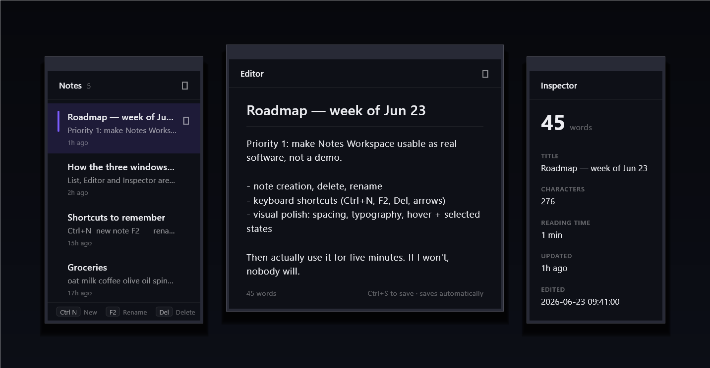

# Morphic

**Morphic is a Flutter Desktop runtime for building real multi-window applications in pure Dart.** It lets you create and orchestrate multiple native desktop windows from a single Flutter application — without writing Win32 or platform-specific windowing code.

Each window is its own Flutter engine; Morphic manages their geometry, z-order,
activation and lifecycle for you. You write ordinary Dart; Morphic gives your
existing UI real OS windows.

> **Morphic is not a UI kit, a widget library, or a design system, and has nothing
> to do with neumorphism.** It does not draw widgets, themes, or animations. Your
> Flutter widgets stay exactly as they are — Morphic is the *runtime* that hosts
> them across multiple native windows.

**Why it exists.** Flutter Desktop gives you one window with one widget tree. Real
desktop software — code editors, IDEs, DAWs, trading and monitoring dashboards,
creative tools — is **multi-window**: inspectors, tool palettes, detached panels,
and whole workspaces. Doing that in Flutter used to mean dropping to C++/Win32.
Morphic makes multi-window a first-class, Dart-only part of your app.

| | |
|---|---|
| **What it is** | A Flutter **desktop runtime** / multi-window app framework |
| **You write** | Pure Dart — your normal Flutter widgets, unchanged |
| **You get** | Real native OS windows, orchestrated: surfaces, ownership, z-order, lifecycle |
| **Windows talk via** | `AppBus` — message passing; windows never reach into each other |
| **For** | Flutter devs building professional desktop apps (IDE-style, creative, dashboards) |
| **Platforms** | Windows today · macOS & Linux on the roadmap |

Think of it as the **multi-window layer Flutter Desktop is missing** — closer to a
windowing runtime than a package. See how it compares to `desktop_multi_window`
and vanilla Flutter desktop at **[getmorphic.space/compare](https://www.getmorphic.space/compare)**.

> ⚠️ Pre-1.0, **Windows-only** today. The install flow and native runtime are
> scratch-verified, but APIs may still evolve.

## See it



The **[Notes Workspace example](examples/notes_workspace)** is a real app you can
run in a minute: a notes **List**, an **Editor** and a live **Inspector** as three
separate native windows, kept in sync over `AppBus`, with edits that persist across
relaunch. ~250 lines of Dart, zero Win32.

```bash
git clone https://github.com/zhadow-dev/morphic
cd morphic/examples/notes_workspace
flutter create --platforms=windows .   # scaffold the windows/ runner
flutter pub get
dart run morphic:init --apply
flutter run -d windows
```

## Prerequisites

- **Flutter** (desktop enabled): `flutter config --enable-windows-desktop`
- **Visual Studio** (not VS Code) with the **“Desktop development with C++”**
  workload — Flutter needs it to build Windows apps. Verify with `flutter doctor`.

## Install

```bash
flutter create my_app && cd my_app
flutter pub add morphic
dart run morphic:init --apply   # patches windows/runner to host the runtime (reversible)
flutter pub get
flutter run -d windows
```

> `morphic:init` is a **dry run** without `--apply` — it prints the plan but
> changes nothing. Use `--apply` to actually install. It leaves `lib/`, your
> pubspec, and every non-Windows platform untouched, and is fully reversible
> (`dart run morphic:remove --apply`). **No C++, no CMake, no Win32.**

## Your first window

A **surface** is a window. Its content is an ordinary Flutter app behind a
top-level `@pragma('vm:entry-point')` function the runtime launches by name:

```dart
// lib/main.dart
import 'package:flutter/material.dart';
import 'package:morphic/morphic.dart';

@pragma('vm:entry-point')
void mainSurface() => runApp(
      const MaterialApp(home: Scaffold(body: Center(child: Text('Hello, Morphic')))),
    );

class MyApp extends MorphicApp {
  @override
  String get name => 'My App';

  @override
  List<SurfaceSpec> surfaces() => const [
        SurfaceSpec.workspace(id: 'main', entrypoint: 'mainSurface'),
      ];
}

void main() => runMorphicApp(app: MyApp());
```

## Multiple windows

Add another spec **and its entrypoint** — each surface is its own engine:

```dart
@pragma('vm:entry-point')
void inspector() => runApp(
      const MaterialApp(home: Scaffold(body: Center(child: Text('Inspector')))),
    );

// in surfaces():
List<SurfaceSpec> surfaces() => const [
      SurfaceSpec.workspace(id: 'main', entrypoint: 'mainSurface'),
      SurfaceSpec.inspector(id: 'info', entrypoint: 'inspector', parent: 'main'),
    ];
```

(`SurfaceSpec` also has `.toolPalette(...)` and `.overlay(...)`.)

## Talk between windows — `AppBus`

Surfaces are isolated engines, so they share state through a tiny event bus:

```dart
// in the editor window
AppBus.broadcast('doc.changed', {'id': docId});

// in the inspector window
AppBus.on('doc.changed', (p) => reload(p['id'] as String));
```

## Surface lifecycle

The runtime publishes lifecycle events on the same bus, and a surface can drive
its own window (it only ever acts on itself):

```dart
AppBus.on('surface.destroyed', (p) => forgetDocFor(p['surfaceId'] as String));

MorphicSurface.minimize();
MorphicSurface.toggleMaximize();
MorphicSurface.close();
```

## Native mode

The above is **native mode** — orchestrated real OS windows, the default and
free. Closing the last window exits the app. No account or network required.

## Frequently Asked Questions

*Full version, with framework comparisons: [What is Morphic?](https://www.getmorphic.space/what-is-morphic)*

### What is Morphic?

Morphic is a Flutter Desktop runtime for building real multi-window applications
in pure Dart. It lets one Flutter application create and orchestrate multiple
native desktop windows without writing Win32 or platform-specific windowing code.

### Is Morphic a UI or widget library?

No. Morphic does not replace Flutter's widget system — you keep building your UI
with Flutter widgets exactly as you do today. Morphic adds a desktop *runtime*
above Flutter that manages multiple native windows, orchestration, lifecycle, and
cross-window communication.

### Is Morphic a replacement for Flutter?

No. Flutter renders your application; Morphic extends Flutter Desktop with the
capabilities professional desktop software needs — multiple native windows,
workspace layouts, tool palettes, inspectors, and window-to-window messaging.

### How is Morphic different from `desktop_multi_window`?

Both let a Flutter app open multiple windows. Morphic is a desktop **runtime**
rather than a window-spawning utility: it adds window orchestration, `AppBus`
messaging, surface lifecycles, reusable workspace patterns, and an upgrade path to
the Spatial Runtime. (Side-by-side table: [getmorphic.space/compare](https://www.getmorphic.space/compare).)

### Does Morphic require Win32 or platform-specific code?

No. You create and manage windows entirely from Dart; the platform-specific
implementation is handled internally by Morphic.

### Is Morphic only for Windows?

Today Morphic targets Flutter Desktop on **Windows**. macOS and Linux are planned
as the runtime evolves — the layered design exists so the upper layers carry over.

### What is the Spatial Runtime?

An optional extension that enables spatial desktop composition and advanced
workspace capabilities. It builds on the same APIs as the open-source runtime, so
applications can adopt it without changing their architecture.

### Who should use Morphic?

Developers building professional desktop software — IDEs, design and engineering
tools, creative apps, dashboard workspaces, trading platforms, data-analysis
tools, and multi-monitor productivity apps.

## Docs

| Doc | For |
|---|---|
| [Quickstart](doc/QUICKSTART.md) | Install → first surface → run, in ~10 minutes |
| [Concepts](doc/CONCEPTS.md) | What a surface / workspace is, and why Morphic works this way |
| [SDK](doc/SDK.md) | The `package:morphic` API + copy-paste patterns |
| [Integration](doc/INTEGRATION.md) | How `morphic:init` installs the runtime |
| [CLI](doc/CLI.md) | The `dart run morphic:*` commands |

`example/` is a showcase / playground, not where you author your own app — that's
`package:morphic` in your own project.

## Spatial Mode

Morphic also supports an optional **Spatial Runtime** for shaped surfaces,
materials, acrylic effects, workspace composition and advanced desktop
experiences.

Learn more → **https://www.getmorphic.space/spatial**
